# Variables, Diagramas de Flujo y UML

## Introducción

Antes de comenzar a programar, es fundamental entender los conceptos básicos de **variables** y cómo representar visualmente las ideas mediante **diagramas**. Esta unidad te proporcionará las herramientas necesarias para estructurar tu pensamiento antes de escribir código.

### 🎯 **Objetivos de aprendizaje**

- ✅ Comprender el concepto de variables y tipos de datos
- ✅ Aprender a crear diagramas de flujo para algoritmos
- ✅ Dominar los diagramas UML para modelar sistemas
- ✅ Desarrollar habilidades de pensamiento estructurado

---

## 📊 Variables y Tipos de Datos

### ¿Qué es una variable?

Una variable es un **contenedor en memoria** que almacena un valor que puede cambiar durante la ejecución del programa.

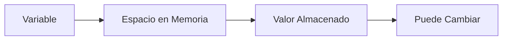

### 🔄 **Ciclo de vida de una variable**

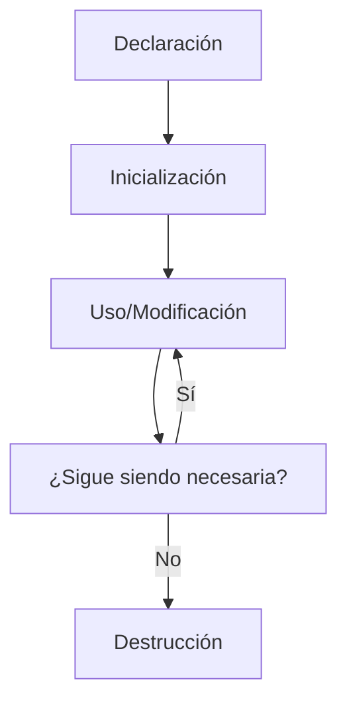

### Conceptos básicos

#### **1. Declaración**
```java
// Declaración de variables
int edad;
String nombre;
double precio;
boolean activo;
```

#### **2. Inicialización**
```java
// Inicialización de variables
int edad = 25;
String nombre = "Juan Pérez";
double precio = 19.99;
boolean activo = true;
```

#### **3. Asignación**
```java
// Asignación de valores
edad = 30;
nombre = "María García";
precio = 29.99;
activo = false;
```

### 📋 Tipos de datos primitivos en Java

| Tipo | Tamaño | Rango | Ejemplo | Uso común |
|------|--------|-------|---------|-----------|
| **byte** | 8 bits | -128 a 127 | `byte edad = 25;` | Edades pequeñas |
| **short** | 16 bits | -32,768 a 32,767 | `short año = 2024;` | Años, códigos |
| **int** | 32 bits | -2³¹ a 2³¹-1 | `int población = 8000000;` | Números enteros |
| **long** | 64 bits | -2⁶³ a 2⁶³-1 | `long habitantes = 8000000000L;` | Números grandes |
| **float** | 32 bits | ±3.4E-38 a ±3.4E+38 | `float precio = 19.99f;` | Decimales simples |
| **double** | 64 bits | ±1.7E-308 a ±1.7E+308 | `double pi = 3.14159;` | Decimales precisos |
| **char** | 16 bits | 0 a 65,535 | `char letra = 'A';` | Caracteres únicos |
| **boolean** | 1 bit | true/false | `boolean activo = true;` | Condiciones |

### 🔢 **Números enteros**
```java
byte edad = 25;           // 8 bits, rango: -128 a 127
short año = 2024;         // 16 bits, rango: -32,768 a 32,767
int población = 8000000;  // 32 bits, rango: -2^31 a 2^31-1
long habitantes = 8000000000L; // 64 bits, rango: -2^63 a 2^63-1
```

### 🔢 **Números decimales**
```java
float precio = 19.99f;    // 32 bits, precisión simple
double pi = 3.14159265359; // 64 bits, precisión doble
```

### 🔤 **Caracteres**
```java
char letra = 'A';         // 16 bits, un carácter Unicode
char símbolo = '€';       // Símbolos especiales
```

### ✅ **Booleanos**
```java
boolean activo = true;    // true o false
boolean mayorEdad = false;
```

### 📝 Tipos de datos de referencia

| Tipo | Descripción | Ejemplo | Características |
|------|-------------|---------|-----------------|
| **String** | Cadena de texto | `String nombre = "Juan";` | Inmutable, secuencia de caracteres |
| **Array** | Colección de elementos | `int[] números = {1,2,3};` | Tamaño fijo, mismo tipo |
| **Clase** | Objeto personalizado | `Usuario user = new Usuario();` | Definido por el programador |

#### **String (Cadena de texto)**
```java
String nombre = "Juan Pérez";
String email = "juan@ejemplo.com";
String dirección = "Calle Principal 123";
```

#### **Arrays (Arreglos)**
```java
int[] números = {1, 2, 3, 4, 5};
String[] colores = {"rojo", "verde", "azul"};
double[] precios = {19.99, 29.99, 39.99};
```

#### **Clases personalizadas**
```java
Usuario usuario = new Usuario();
Producto producto = new Producto();
```

### 🔄 Conversión de tipos (Casting)

#### **Conversión implícita (automática)**
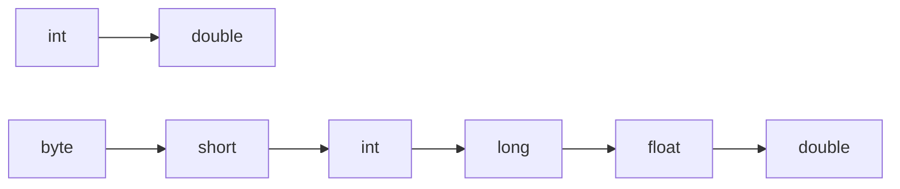

```java
int número = 10;
double decimal = número; // Conversión automática de int a double
```

#### **Conversión explícita (manual)**
```java
double decimal = 10.5;
int número = (int) decimal; // Conversión manual de double a int
```

### ⚙️ Operaciones con variables

#### **Operaciones aritméticas**
```java
int a = 10;
int b = 5;

int suma = a + b;        // 15
int resta = a - b;       // 5
int multiplicación = a * b; // 50
int división = a / b;    // 2
int módulo = a % b;      // 0
```

#### **Operaciones de asignación**
```java
int x = 10;
x += 5;  // Equivale a: x = x + 5
x -= 3;  // Equivale a: x = x - 3
x *= 2;  // Equivale a: x = x * 2
x /= 4;  // Equivale a: x = x / 4
```

#### **Operaciones de incremento/decremento**
```java
int contador = 5;
contador++;  // Incremento postfijo: 5, luego 6
++contador;  // Incremento prefijo: 7
contador--;  // Decremento postfijo: 7, luego 6
--contador;  // Decremento prefijo: 5
```

### 🎯 Ámbito de variables (Scope)

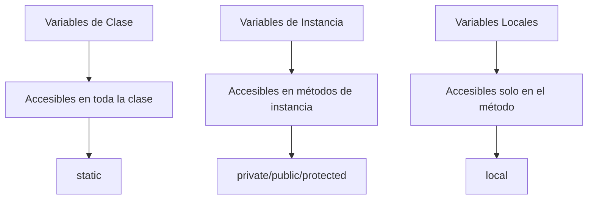

#### **Variables locales**
```java
public void método() {
    int variableLocal = 10; // Solo accesible dentro del método
    System.out.println(variableLocal);
}
// variableLocal no es accesible aquí
```

#### **Variables de instancia**
```java
public class Usuario {
    private String nombre; // Variable de instancia
    private int edad;      // Variable de instancia
    
    public void mostrarInfo() {
        System.out.println(nombre + " tiene " + edad + " años");
    }
}
```

#### **Variables de clase (estáticas)**
```java
public class Configuración {
    public static final String VERSIÓN = "1.0"; // Variable de clase
    public static int contador = 0;              // Variable de clase
    
    public static void incrementarContador() {
        contador++;
    }
}
```

### 🔒 Constantes

#### **Constantes en Java**
```java
public class Constantes {
    public static final double PI = 3.14159;
    public static final String NOMBRE_APP = "Mi Aplicación";
    public static final int EDAD_MINIMA = 18;
}
```

### 💡 Ejemplo práctico: Calculadora simple

```java
public class Calculadora {
    public static void main(String[] args) {
        // Declaración de variables
        double numero1, numero2, resultado;
        char operacion;
        
        // Inicialización
        numero1 = 10.5;
        numero2 = 5.2;
        operacion = '+';
        
        // Proceso según la operación
        switch (operacion) {
            case '+':
                resultado = numero1 + numero2;
                break;
            case '-':
                resultado = numero1 - numero2;
                break;
            case '*':
                resultado = numero1 * numero2;
                break;
            case '/':
                if (numero2 != 0) {
                    resultado = numero1 / numero2;
                } else {
                    System.out.println("Error: División por cero");
                    return;
                }
                break;
            default:
                System.out.println("Operación no válida");
                return;
        }
        
        // Mostrar resultado
        System.out.println(numero1 + " " + operacion + " " + numero2 + " = " + resultado);
    }
}
```

---

## 🔄 Diagramas de Flujo

### ¿Qué es un diagrama de flujo?

Un diagrama de flujo es una **representación gráfica** de un algoritmo o proceso, mostrando los pasos como cajas de diferentes tipos y su orden mediante flechas.

### 📐 Símbolos básicos

| Símbolo | Forma | Función | Ejemplo |
|---------|-------|---------|---------|
| **Inicio/Fin** | 🔵 Óvalo | Marca el comienzo o final | `[Inicio]` |
| **Proceso** | 🔷 Rectángulo | Acción u operación | `[Calcular suma]` |
| **Decisión** | 🔶 Rombo | Pregunta o condición | `{¿Es válido?}` |
| **Entrada/Salida** | 🔸 Paralelogramo | Datos de entrada/salida | `[Leer nombre]` |
| **Conector** | 🔻 Triángulo | Conecta partes del diagrama | `[A]` |

### 🔐 Ejemplo: Algoritmo de login

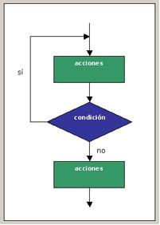

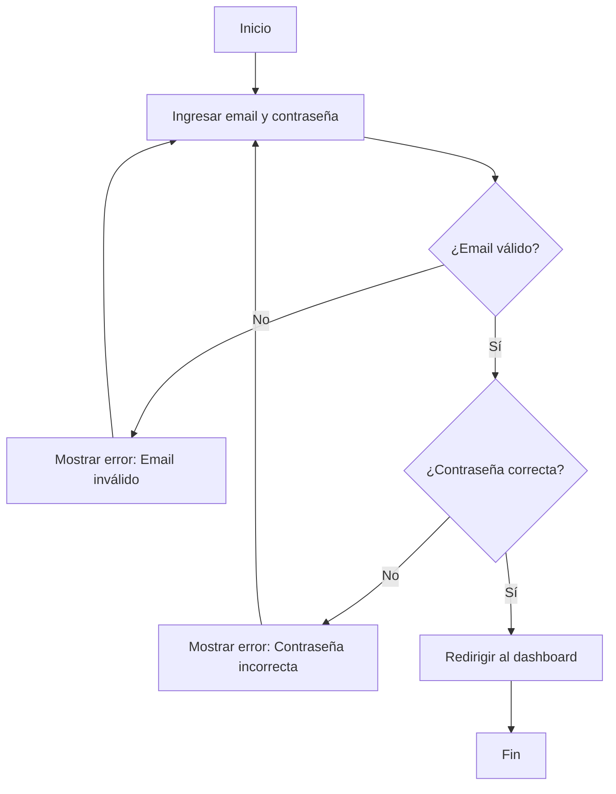

### 🔍 Ejemplo: Algoritmo de búsqueda

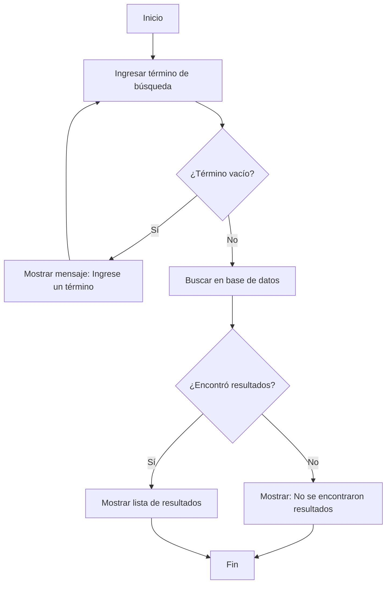

### 📊 Ejemplo: Cálculo de promedio

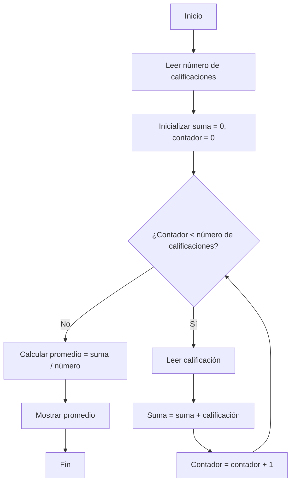

### ✅ Mejores prácticas para diagramas de flujo

#### **Recomendaciones:**
- ✅ Usar símbolos estándar
- ✅ Mantener el flujo de izquierda a derecha y de arriba hacia abajo
- ✅ Usar colores para diferenciar tipos de procesos
- ✅ Mantener el diagrama simple y legible
- ✅ Incluir comentarios cuando sea necesario

#### **Errores a evitar:**
- ❌ Flujos que se cruzan
- ❌ Símbolos no estándar
- ❌ Diagramas demasiado complejos
- ❌ Falta de consistencia en la nomenclatura

---

## 🏗️ Diagramas UML (Unified Modeling Language)

### ¿Qué es UML?

UML es un **lenguaje de modelado visual estándar** que se utiliza para especificar, visualizar, construir y documentar los artefactos de un sistema de software.

### 📊 Tipos principales de diagramas UML

| Tipo de Diagrama | Propósito | Cuándo usar |
|------------------|-----------|-------------|
| **Diagrama de Clases** | Estructura estática del sistema | Diseño de clases y relaciones |
| **Diagrama de Secuencia** | Interacciones entre objetos | Flujo de mensajes y tiempo |
| **Diagrama de Casos de Uso** | Funcionalidades del sistema | Análisis de requerimientos |
| **Diagrama de Actividad** | Flujo de trabajo | Procesos de negocio |
| **Diagrama de Estados** | Estados de un objeto | Comportamiento de objetos |

### 🏛️ 1. Diagrama de Clases

Representa la **estructura estática** del sistema, mostrando las clases, sus atributos, métodos y las relaciones entre ellas.

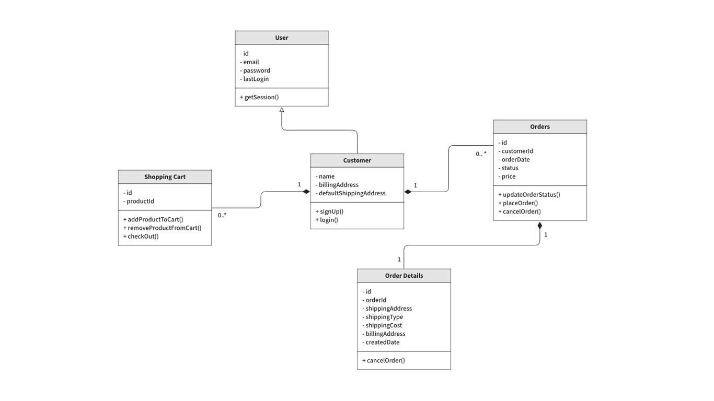

```mermaid
classDiagram
    class Usuario {
        -String nombre
        -String email
        -int edad
        +registrar()
        +actualizarPerfil()
        +eliminar()
    }
    
    class Post {
        -String titulo
        -String contenido
        -Date fechaPublicacion
        +crear()
        +editar()
        +eliminar()
    }
    
    class Comentario {
        -String contenido
        -Date fechaComentario
        +agregar()
        +eliminar()
    }
    
    Usuario ||--o{ Post : crea
    Post ||--o{ Comentario : tiene
    Usuario ||--o{ Comentario : escribe
```

**Elementos del diagrama de clases:**

| Elemento | Símbolo | Descripción |
|----------|---------|-------------|
| **Clase** | Rectángulo dividido en 3 | Nombre, atributos, métodos |
| **Atributos** | `-nombre: tipo` | Propiedades de la clase |
| **Métodos** | `+nombre()` | Comportamientos de la clase |
| **Relaciones** | Líneas con símbolos | Asociación, herencia, etc. |

### ⏱️ 2. Diagrama de Secuencia

Muestra la **interacción entre objetos** a lo largo del tiempo, representando el orden de los mensajes.

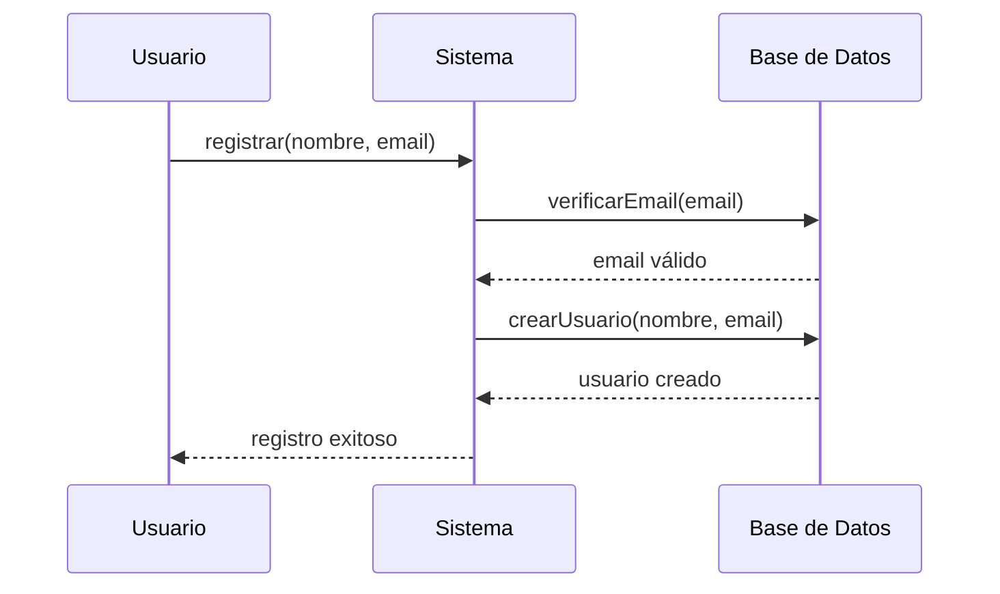

**Elementos del diagrama de secuencia:**

| Elemento | Descripción | Ejemplo |
|----------|-------------|---------|
| **Actor** | Entidad externa al sistema | Usuario, Sistema externo |
| **Objeto** | Instancia de una clase | Sistema, Base de Datos |
| **Línea de vida** | Tiempo de vida del objeto | Línea vertical punteada |
| **Mensajes** | Comunicación entre objetos | `registrar()`, `verificarEmail()` |

### 🎯 3. Diagrama de Casos de Uso

Describe las **funcionalidades del sistema** desde la perspectiva del usuario.

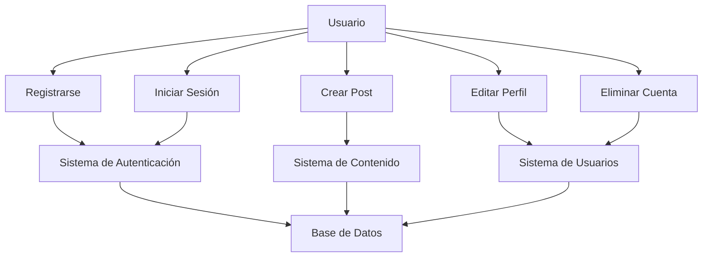

**Elementos del diagrama de casos de uso:**

| Elemento | Símbolo | Descripción |
|----------|---------|-------------|
| **Actor** | Figura humana | Usuario o sistema externo |
| **Caso de uso** | Óvalo | Funcionalidad del sistema |
| **Sistema** | Rectángulo | Límite del software |
| **Relaciones** | Líneas | Asociación, inclusión, extensión |

### 🔄 4. Diagrama de Actividad

Representa el **flujo de trabajo** y los procesos de negocio.

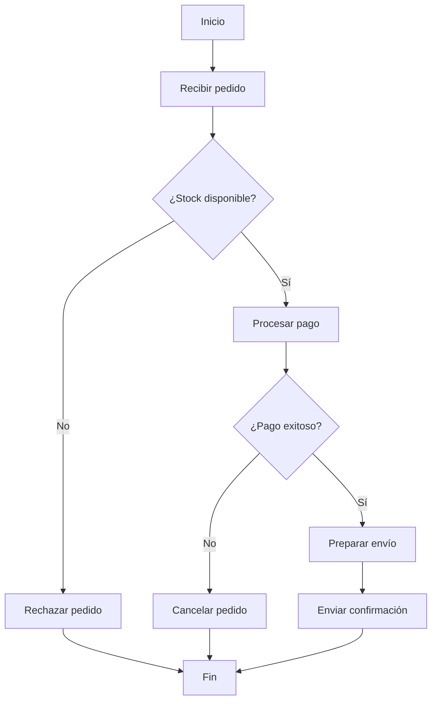

### 🏗️ 5. Diagrama de Estados

Muestra los **estados de un objeto** y las transiciones entre ellos.

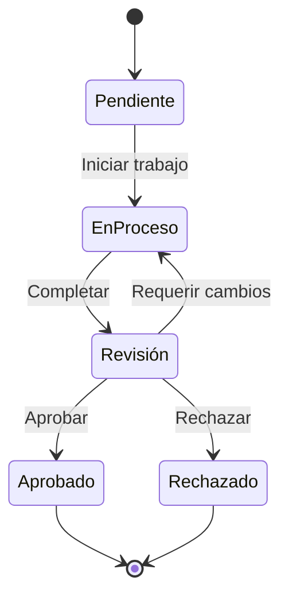

### 🛠️ Herramientas para crear diagramas UML

#### **Herramientas gratuitas**
| Herramienta | Características | Enlace |
|-------------|-----------------|--------|
| **Draw.io** | Editor online gratuito | [draw.io](https://draw.io) |
| **Lucidchart** | Versión gratuita limitada | [lucidchart.com](https://lucidchart.com) |
| **Visual Paradigm** | Versión community | [visual-paradigm.com](https://visual-paradigm.com) |
| **PlantUML** | Editor basado en texto | [plantuml.com](https://plantuml.com) |

#### **Herramientas de pago**
| Herramienta | Características | Precio |
|-------------|-----------------|--------|
| **Enterprise Architect** | Profesional y completa | $599+ |
| **Rational Rose** | Herramienta clásica de IBM | $1,000+ |
| **Visual Studio** | Integración con .NET | Incluido |

---

## 🎯 Ejercicios prácticos

### Ejercicio 1: Variables y tipos
1. Crea un programa que calcule el área de diferentes figuras geométricas
2. Usa variables de diferentes tipos (int, double, String)
3. Implementa conversiones de tipos
4. Maneja casos de error (división por cero, valores negativos)

### Ejercicio 2: Diagrama de flujo
1. Crea un diagrama de flujo para el proceso de reserva de un hotel
2. Incluye validaciones de disponibilidad y fechas
3. Considera casos de error (fechas pasadas, habitaciones no disponibles)
4. Usa símbolos estándar y colores para diferenciar procesos

### Ejercicio 3: Diagrama de clases
1. Crea un diagrama de clases para un sistema de biblioteca
2. Incluye las clases: Libro, Usuario, Préstamo, Biblioteca
3. Define atributos y métodos para cada clase
4. Establece las relaciones entre las clases (herencia, asociación, composición)

### Ejercicio 4: Sistema completo
1. Diseña un sistema de gestión de estudiantes
2. Crea el diagrama UML de clases
3. Desarrolla el diagrama de flujo para el registro de estudiantes
4. Implementa las variables y tipos necesarios en Java

---

## 📚 Recursos adicionales

### Variables y tipos en Java
- [Documentación oficial Java](https://docs.oracle.com/javase/tutorial/java/nutsandbolts/datatypes.html)
- [Tutorial de variables](https://www.w3schools.com/java/java_variables.asp)
- [Tipos de datos en Java](https://www.geeksforgeeks.org/data-types-in-java/)

### Diagramas de flujo
- [Símbolos estándar](https://www.lucidchart.com/pages/es/simbolos-de-diagramas-de-flujo)
- [Tutorial de diagramas de flujo](https://www.draw.io/)
- [Mejores prácticas](https://www.smartdraw.com/flowchart/flowchart-symbols.htm)

### UML
- [Documentación oficial UML](https://www.uml.org/)
- [Tutorial UML en español](https://www.uml-diagrams.org/)
- [PlantUML - Editor online](https://plantuml.com/)
- [Guía de diagramas UML](https://www.visual-paradigm.com/guide/uml-unified-modeling-language/)
