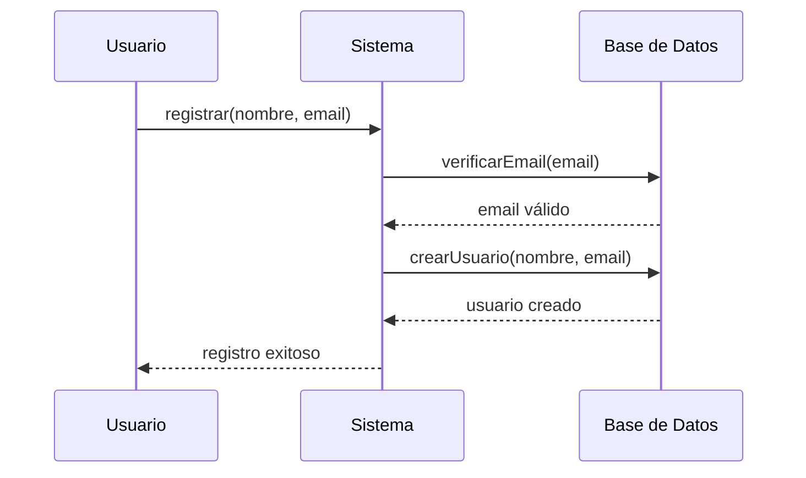
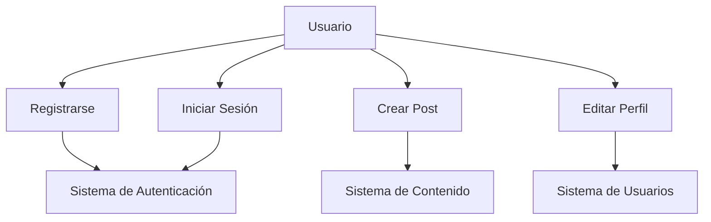
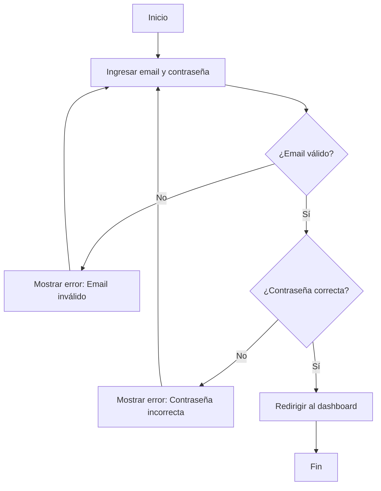
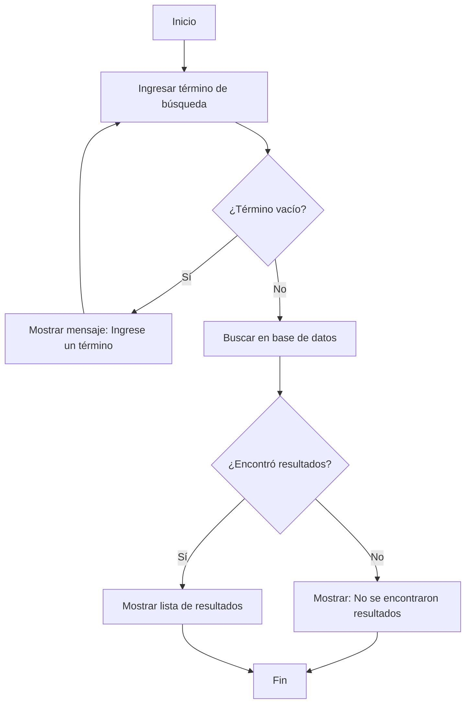

# Diagramas UML, de Flujo y Variables

## Introducción

Antes de comenzar a programar, es fundamental entender cómo representar visualmente las ideas y conceptos. En esta unidad aprenderemos sobre **diagramas UML**, **diagramas de flujo** y los conceptos básicos de **variables y tipos de datos**.

### ¿Por qué son importantes los diagramas?

- **Comunicación**: Permiten expresar ideas de forma clara y visual
- **Planificación**: Ayudan a estructurar el pensamiento antes de programar
- **Documentación**: Sirven como referencia para entender el código
- **Colaboración**: Facilitan el trabajo en equipo

## Diagramas UML (Unified Modeling Language)

### ¿Qué es UML?

UML es un lenguaje de modelado visual estándar que se utiliza para especificar, visualizar, construir y documentar los artefactos de un sistema de software.

#### Tipos principales de diagramas UML

##### 1. **Diagrama de Clases**
Representa la estructura estática del sistema, mostrando las clases, sus atributos, métodos y las relaciones entre ellas.

```mermaid
classDiagram
    class Usuario {
        -String nombre
        -String email
        -int edad
        +registrar()
        +actualizarPerfil()
        +eliminar()
    }
    
    class Post {
        -String titulo
        -String contenido
        -Date fechaPublicacion
        +crear()
        +editar()
        +eliminar()
    }
    
    Usuario ||--o{ Post : crea
```

**Elementos del diagrama de clases:**
- **Clase**: Representada como un rectángulo dividido en tres secciones
- **Atributos**: Propiedades de la clase (nombre, tipo, visibilidad)
- **Métodos**: Comportamientos de la clase (nombre, parámetros, tipo de retorno)
- **Relaciones**: Asociaciones, herencia, composición, agregación

##### 2. **Diagrama de Secuencia**
Muestra la interacción entre objetos a lo largo del tiempo, representando el orden de los mensajes.



**Elementos del diagrama de secuencia:**
- **Actores**: Entidades externas al sistema
- **Objetos**: Instancias de clases
- **Línea de vida**: Representa el tiempo de vida del objeto
- **Mensajes**: Comunicación entre objetos

##### 3. **Diagrama de Casos de Uso**
Describe las funcionalidades del sistema desde la perspectiva del usuario.



**Elementos del diagrama de casos de uso:**
- **Actor**: Usuario o sistema externo
- **Caso de uso**: Funcionalidad del sistema
- **Sistema**: Límite del software
- **Relaciones**: Asociación, inclusión, extensión

### Herramientas para crear diagramas UML

#### Herramientas gratuitas
- **Draw.io**: Editor online gratuito
- **Lucidchart**: Versión gratuita limitada
- **Visual Paradigm**: Versión community
- **PlantUML**: Editor basado en texto

#### Herramientas de pago
- **Enterprise Architect**: Profesional y completa
- **Rational Rose**: Herramienta clásica de IBM
- **Visual Studio**: Integración con .NET

## Diagramas de Flujo

### ¿Qué es un diagrama de flujo?

Un diagrama de flujo es una representación gráfica de un algoritmo o proceso, mostrando los pasos como cajas de diferentes tipos y su orden mediante flechas.

### Símbolos básicos

#### 🔵 **Óvalo**: Inicio/Fin
Representa el comienzo o final de un proceso.

#### 🔷 **Rectángulo**: Proceso
Representa una acción o operación.

#### 🔶 **Rombo**: Decisión
Representa una pregunta o condición que requiere una respuesta sí/no.

#### 🔸 **Paralelogramo**: Entrada/Salida
Representa la entrada o salida de datos.

#### 🔻 **Triángulo**: Conector
Conecta diferentes partes del diagrama.

### Ejemplo: Algoritmo de login



### Ejemplo: Algoritmo de búsqueda



### Mejores prácticas para diagramas de flujo

#### ✅ **Recomendaciones:**
- Usar símbolos estándar
- Mantener el flujo de izquierda a derecha y de arriba hacia abajo
- Usar colores para diferenciar tipos de procesos
- Mantener el diagrama simple y legible
- Incluir comentarios cuando sea necesario

#### ❌ **Evitar:**
- Flujos que se cruzan
- Símbolos no estándar
- Diagramas demasiado complejos
- Falta de consistencia en la nomenclatura

## Variables y Tipos de Datos

### ¿Qué es una variable?

Una variable es un espacio en memoria que almacena un valor que puede cambiar durante la ejecución del programa.

### Conceptos básicos

#### **Declaración**
```java
// Declaración de variables
int edad;
String nombre;
double precio;
boolean activo;
```

#### **Inicialización**
```java
// Inicialización de variables
int edad = 25;
String nombre = "Juan Pérez";
double precio = 19.99;
boolean activo = true;
```

#### **Asignación**
```java
// Asignación de valores
edad = 30;
nombre = "María García";
precio = 29.99;
activo = false;
```

### Tipos de datos primitivos en Java

#### 🔢 **Números enteros**
```java
byte edad = 25;           // 8 bits, rango: -128 a 127
short año = 2024;         // 16 bits, rango: -32,768 a 32,767
int población = 8000000;  // 32 bits, rango: -2^31 a 2^31-1
long habitantes = 8000000000L; // 64 bits, rango: -2^63 a 2^63-1
```

#### 🔢 **Números decimales**
```java
float precio = 19.99f;    // 32 bits, precisión simple
double pi = 3.14159265359; // 64 bits, precisión doble
```

#### 🔤 **Caracteres**
```java
char letra = 'A';         // 16 bits, un carácter Unicode
char símbolo = '€';       // Símbolos especiales
```

#### ✅ **Booleanos**
```java
boolean activo = true;    // true o false
boolean mayorEdad = false;
```

### Tipos de datos de referencia

#### 📝 **String (Cadena de texto)**
```java
String nombre = "Juan Pérez";
String email = "juan@ejemplo.com";
String dirección = "Calle Principal 123";
```

#### 📦 **Arrays (Arreglos)**
```java
int[] números = {1, 2, 3, 4, 5};
String[] colores = {"rojo", "verde", "azul"};
double[] precios = {19.99, 29.99, 39.99};
```

#### 🏗️ **Clases personalizadas**
```java
Usuario usuario = new Usuario();
Producto producto = new Producto();
```

### Conversión de tipos (Casting)

#### **Conversión implícita (automática)**
```java
int número = 10;
double decimal = número; // Conversión automática de int a double
```

#### **Conversión explícita (manual)**
```java
double decimal = 10.5;
int número = (int) decimal; // Conversión manual de double a int
```

### Operaciones con variables

#### **Operaciones aritméticas**
```java
int a = 10;
int b = 5;

int suma = a + b;        // 15
int resta = a - b;       // 5
int multiplicación = a * b; // 50
int división = a / b;    // 2
int módulo = a % b;      // 0
```

#### **Operaciones de asignación**
```java
int x = 10;
x += 5;  // Equivale a: x = x + 5
x -= 3;  // Equivale a: x = x - 3
x *= 2;  // Equivale a: x = x * 2
x /= 4;  // Equivale a: x = x / 4
```

#### **Operaciones de incremento/decremento**
```java
int contador = 5;
contador++;  // Incremento postfijo: 5, luego 6
++contador;  // Incremento prefijo: 7
contador--;  // Decremento postfijo: 7, luego 6
--contador;  // Decremento prefijo: 5
```

### Ámbito de variables (Scope)

#### **Variables locales**
```java
public void método() {
    int variableLocal = 10; // Solo accesible dentro del método
    System.out.println(variableLocal);
}
// variableLocal no es accesible aquí
```

#### **Variables de instancia**
```java
public class Usuario {
    private String nombre; // Variable de instancia
    private int edad;      // Variable de instancia
    
    public void mostrarInfo() {
        System.out.println(nombre + " tiene " + edad + " años");
    }
}
```

#### **Variables de clase (estáticas)**
```java
public class Configuración {
    public static final String VERSIÓN = "1.0"; // Variable de clase
    public static int contador = 0;              // Variable de clase
    
    public static void incrementarContador() {
        contador++;
    }
}
```

### Constantes

#### **Constantes en Java**
```java
public class Constantes {
    public static final double PI = 3.14159;
    public static final String NOMBRE_APP = "Mi Aplicación";
    public static final int EDAD_MINIMA = 18;
}
```

### Ejemplo práctico: Calculadora simple

```java
public class Calculadora {
    public static void main(String[] args) {
        // Declaración de variables
        double numero1, numero2, resultado;
        char operacion;
        
        // Inicialización
        numero1 = 10.5;
        numero2 = 5.2;
        operacion = '+';
        
        // Proceso según la operación
        switch (operacion) {
            case '+':
                resultado = numero1 + numero2;
                break;
            case '-':
                resultado = numero1 - numero2;
                break;
            case '*':
                resultado = numero1 * numero2;
                break;
            case '/':
                if (numero2 != 0) {
                    resultado = numero1 / numero2;
                } else {
                    System.out.println("Error: División por cero");
                    return;
                }
                break;
            default:
                System.out.println("Operación no válida");
                return;
        }
        
        // Mostrar resultado
        System.out.println(numero1 + " " + operacion + " " + numero2 + " = " + resultado);
    }
}
```

## Herramientas para crear diagramas

### Herramientas gratuitas
- **Draw.io**: Editor online versátil
- **Lucidchart**: Herramienta profesional con versión gratuita
- **Visual Studio Code**: Extensiones para diagramas
- **PlantUML**: Editor basado en texto

### Herramientas específicas
- **UML**: Enterprise Architect, Rational Rose
- **Flujo**: Visio, Draw.io, Lucidchart
- **Código**: IntelliJ IDEA, Eclipse, Visual Studio

## Ejercicios prácticos

### Ejercicio 1: Diagrama de clases
1. Crea un diagrama de clases para un sistema de biblioteca
2. Incluye las clases: Libro, Usuario, Préstamo
3. Define atributos y métodos para cada clase
4. Establece las relaciones entre las clases

### Ejercicio 2: Diagrama de flujo
1. Crea un diagrama de flujo para el proceso de reserva de un hotel
2. Incluye validaciones de disponibilidad
3. Considera casos de error
4. Usa símbolos estándar

### Ejercicio 3: Variables y tipos
1. Crea un programa que calcule el área de diferentes figuras geométricas
2. Usa variables de diferentes tipos
3. Implementa conversiones de tipos
4. Maneja casos de error

### Ejercicio 4: Sistema completo
1. Diseña un sistema de gestión de estudiantes
2. Crea el diagrama UML de clases
3. Desarrolla el diagrama de flujo para el registro
4. Implementa las variables y tipos necesarios

---

## Recursos adicionales

### UML
- [Documentación oficial UML](https://www.uml.org/)
- [Tutorial UML en español](https://www.uml-diagrams.org/)
- [PlantUML - Editor online](https://plantuml.com/)

### Diagramas de flujo
- [Símbolos estándar](https://www.lucidchart.com/pages/es/simbolos-de-diagramas-de-flujo)
- [Tutorial de diagramas de flujo](https://www.draw.io/)

### Variables y tipos en Java
- [Documentación oficial Java](https://docs.oracle.com/javase/tutorial/java/nutsandbolts/datatypes.html)
- [Tutorial de variables](https://www.w3schools.com/java/java_variables.asp)
